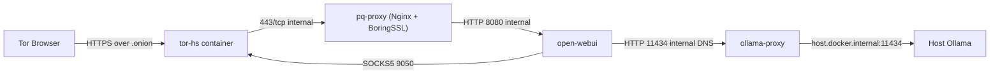

# Open-WebUI with Tor Hidden Service & Post-Quantum TLS (BoringSSL Edition)

This project runs the Open-WebUI AI interface behind a Tor hidden service, with an additional TLS layer on top of Tor. The proxy is configured in strict PQ-only mode: it offers modern **X25519MLKEM768** first, keeps **X25519Kyber768Draft00** as legacy compatibility, and does not allow classical **X25519** fallback. It uses Docker Compose to manage four containers:

- **tor-hs**: A minimal Alpine container running Tor, configured to expose the WebUI's PQ proxy via a `.onion` address on port 443 (HTTPS).
- **pq-proxy**: An Nginx container built from scratch. It acts as a reverse proxy, listening for HTTPS traffic from Tor, terminating TLS with preferred **X25519MLKEM768** and compatibility **X25519Kyber768Draft00** only, then forwarding traffic to the Open-WebUI container.
- **ollama-proxy**: An internal Nginx proxy that exposes your host Ollama endpoint to Open-WebUI on a private Docker network only.
- **open-webui**: The upstream Open-WebUI container serving the AI interface internally on port 8080. Wrapped with proxychains4 so that outbound HTTP/TCP traffic (except internal local routes such as Ollama proxy traffic) is routed through Tor's SOCKS proxy.

All persistent user data (Tor keys, WebUI database/cache) and generated certificates are stored in a local `./data/` directory, organized into subdirectories.

### TL;DR

- You get a self-hosted Open-WebUI reachable over a Tor `.onion` address.
- TLS is terminated on an internal BoringSSL Nginx proxy in strict PQ-only mode (`X25519MLKEM768`, then `X25519Kyber768Draft00`).
- WebUI outbound traffic is routed through Tor via proxychains, while local Ollama traffic stays on Docker-internal DNS (`ollama-proxy`).
- Containers are isolated, non-root where possible, and now include healthchecks for better startup reliability.

### Threat Model (Practical)

| Goal | Covered? | Notes |
| :--- | :--- | :--- |
| Hide service location from direct internet scans | Yes | Exposed only as Tor hidden service. |
| Reduce metadata leakage for outbound model calls | Yes (partial) | Proxychains routes outbound TCP via Tor; local/internal destinations are exempted. |
| Add an additional PQ-hybrid TLS layer | Yes (experimental) | Enforced with `X25519MLKEM768` then `X25519Kyber768Draft00`; clients without those groups cannot connect. |
| Defend against host compromise | No | If host is compromised, container isolation is not enough. |
| Defend against malicious browser endpoint | Partial | TLS/Tor help in transit, but endpoint compromise remains out of scope. |

### Architecture



### Why Post-Quantum TLS for your Open-WebUI Onion Service?

This project implements an additional TLS layer on top of Tor's existing protections. In this build, the proxy enforces PQ-only key exchange: `X25519MLKEM768` first, then `X25519Kyber768Draft00` for legacy compatibility, with no classical fallback. The primary motivation is to improve **forward secrecy against future quantum adversaries**.

Currently, while Tor provides strong anonymity and encryption, the underlying cryptographic algorithms used for its onion routing are not yet standardized to be quantum-resistant. If encrypted Tor traffic were to be intercepted and stored today, a sufficiently powerful quantum computer in the future could potentially decrypt it.

By adding this TLS layer at the edge (terminated by `pq-proxy`):
-   **Enhanced Confidentiality for AI Conversations**: Sensitive data, such as your interactions with your local AIs, gains an extra layer of protection designed to resist decryption even by future quantum computers.
-   **Post-Quantum Hybrid Only**: The handshake must negotiate `X25519MLKEM768` or `X25519Kyber768Draft00`. Clients without support for these groups are intentionally rejected.

This setup provides a robust defense-in-depth strategy, aiming to protect your Open-WebUI communications against passive attackers of today and tomorrow.

### Why Use a Tor Hidden Service for Open-WebUI?

Using a Tor Hidden Service (`.onion` service) as the access point for your Open-WebUI instance offers several distinct advantages, especially when combined with the Post-Quantum TLS proxy:

-   **Direct, Secure Access without Port Forwarding**:
    -   A Tor Hidden Service allows you to connect directly to the Open-WebUI instance running on your machine (or wherever the Docker containers are hosted) from anywhere in the world using a Tor-capable browser.
    -   This is achieved **without needing to open any ports on your router/firewall** or configuring complex NAT traversal. It's incredibly useful for accessing your local Ollama setup for true end-to-end encrypted and anonymous chats from your other devices, or even for securely sharing access with friends by leveraging Open-WebUI's multi-user account features.

-   **Enhanced Security and Controlled Exposure**:
    -   The `.onion` address only exposes the Nginx `pq-proxy` container. This proxy, in turn, only forwards traffic to the Open-WebUI container.
    -   This setup acts as a form of firewall for your host machine. No other services running on your host or within your local network are inadvertently exposed to the internet. Only the specifically configured path through Tor and the PQ proxy to Open-WebUI is accessible.

-   **Tor's Performance is Sufficient for WebUI Traffic**:
    -   While Tor can introduce latency for some applications, its performance is generally more than adequate for the type of traffic generated by Open-WebUI (text, occasional images). The user experience for chatting with an LLM is typically not significantly impacted by Tor's routing.

**Overall Synergy for Private, Secure, and Anonymous LLM Access:**

The combination of a Tor Hidden Service, a TLS proxy (using BoringSSL with strict PQ-only groups), and Open-WebUI (with a local LLM like Ollama) creates a powerful, synergistic setup. It offers a pathway to:
-   **True End-to-End Security**: From your PQ-capable browser to the PQ proxy, with Tor's onion routing in between.
-   **Privacy and Anonymity**: Leveraging Tor's inherent capabilities.
-   **Self-Hosted Control**: Keeping your data and AI interactions on your own hardware.
-   **Best-in-Class User Interface**: Benefiting from Open-WebUI's rich features.

This architecture aims to provide a comprehensive solution for individuals seeking a high degree of security, privacy, and control over their Large Language Model interactions.

### Feature Overview

| Feature                                       | Description                                                                                                                                  |
| :-------------------------------------------- | :------------------------------------------------------------------------------------------------------------------------------------------- |
| **Open-WebUI Access**                       | Access the Open-WebUI AI interface.                                                                                                          |
| **Tor Hidden Service**                      | Exposes the WebUI via a `.onion` address for direct, secure access without port forwarding.                                                  |
| **Post-Quantum TLS (Strict PQ-Only)**      | Enforces **X25519MLKEM768** (preferred) and **X25519Kyber768Draft00** (legacy compatibility); no classical fallback.                               |
| **Dockerized Setup**                        | Manages Tor, Nginx (PQ Proxy), and Open-WebUI in separate Docker containers for isolation and ease of deployment.                            |
| **Anonymized Outbound Traffic**               | Routes Open-WebUI's outbound HTTP/TCP traffic (e.g., remote LLM API calls) through Tor's SOCKS proxy.                                        |
| **Data Persistence**                        | Stores Tor keys, WebUI database/cache, and generated certificates locally in a `./data/` directory.                                          |
| **Automated Setup Script**                  | Includes `run.sh` for easy setup of environment variables, certificate generation, and service startup.                            |
| **Healthchecked Startup**                   | Uses container healthchecks and `depends_on` healthy conditions to reduce race conditions at boot.                                         |
| **Multi-User Support**                      | Leverages Open-WebUI's multi-user account features for shared access.                                                                        |
| **Self-Hosted Control**                     | Keeps data and AI interactions on your own hardware.                                                                                         |
| **Enhanced Confidentiality for AI Chats**   | Adds an extra layer of protection for sensitive AI conversations against future quantum decryption.                                            |
| **Firewalled Exposure**                     | Only exposes the Nginx `pq-proxy` via the `.onion` address, protecting other host services.                                                    |

### Security Posture

| Security Aspect                                     | Status                 | Details                                                                                               |
| :-------------------------------------------------- | :--------------------- | :---------------------------------------------------------------------------------------------------- |
| **Protection against passive quantum attackers**    | Yes (experimental)     | Only `X25519MLKEM768` or `X25519Kyber768Draft00` are accepted at TLS handshake; no classical `X25519` path. |
| **Protection in case of Tor container compromise**  | Yes                    | Achieved via separation of concerns; `pq-proxy` (handling plaintext) is in a separate container.       |
| **Standard Tor Network Protections**                | Yes                    | Inherits anonymity and encryption benefits from Tor's onion routing.                                    |
| **Protection against active quantum attackers**     | Partial/Experimental   | Dependent on browser and server support for PQ algorithms; focuses on forward secrecy for stored data. |
| **End-to-End Encryption (Browser to PQ Proxy)**   | Yes                    | Always TLS with mandatory PQ-hybrid groups; unsupported clients fail closed.                            |

### Privacy-Preserving Proprietary Communications
If you need to integrate proprietary LLM endpoints while preserving privacy and anonymity, we recommend using [OpenRouter](https://openrouter.ai/) with crypto-based payments. OpenRouter acts as a neutral middleware supporting various proprietary models, and by paying with cryptocurrencies, you avoid linking your identity or billing information. Combined with our Tor proxy setup, this enables more private, end-to-end encrypted interactions even with closed-source AI services.

### Prerequisites

- Docker Engine
- Docker Compose plugin or standalone `docker-compose`
- **A recent Tor-capable browser.**
    - Tor Browser stable is recommended.
    - No manual `about:config` flag is required for basic connectivity.
    - On iOS, there is no official Tor Browser app; use Onion Browser.
- **OpenSSL command-line tool** (standard version is fine) for generating the `WEBUI_SECRET_KEY` and for the certificate generation step if done manually (though `run.sh` uses a Docker image for certs).

### Browser Compatibility (As of 2026-03-03)

- Tor Browser stable `15.0.7` is based on Firefox `140.8.0esr` ([source](https://blog.torproject.org/new-release-tor-browser-1507/)).
- This repository pins BoringSSL to commit `d0fcf495` (Mar 3, 2026), which supports both `X25519MLKEM768` and `X25519Kyber768Draft00`.
- `pq-proxy` is configured to allow `X25519MLKEM768` first, then `X25519Kyber768Draft00` only.
- Result: service is strict PQ-only at TLS layer; clients lacking those groups will fail the TLS handshake.

### Quick Start

This project includes a `run.sh` script to automate setup. Simply run:
```bash
chmod +x run.sh
./run.sh
```
This script will:
1. Check for Docker.
2. Set up `WEBUI_SECRET_KEY`, `WEBUI_UID`, and `WEBUI_GID` in a `.env` file (generating missing values if needed).
   - If an older `.env` uses `OLLAMA_BASE_URL=http://host.docker.internal:11434`, the script migrates it to `http://ollama-proxy:11434`.
3. Generate ECDSA P-256 self-signed certificates into `./data/pq_proxy_certs/` if not already present (these are used by Nginx/BoringSSL for the TLS handshake; key exchange is strict PQ-only: `X25519MLKEM768`, then `X25519Kyber768Draft00`).
4. Build images as needed and start the Docker Compose services.

Follow the on-screen instructions from the script. After it completes:

1.  Wait ~30-60 seconds for Tor to bootstrap and publish the hidden service.
2.  Retrieve your `.onion` address:
    ```bash
    cat ./data/tor_hs_data/hs/hostname
    ```
3.  Open the **`https://<your-onion-address>.onion`** URL in Tor Browser (stable is fine).
    - Note the `https://`. Your browser will likely warn about a self-signed certificate (the P-256 cert), which is expected in this setup.

### Self-Signed TLS on Onion (Expected)

- On a `.onion` service, endpoint authenticity primarily comes from the onion address itself (derived from the hidden service key).
- The self-signed TLS certificate here is an additional transport layer (with strict PQ-hybrid key exchange), not the primary identity anchor.
- A browser warning is therefore expected unless you manually trust/pin the certificate.

If you want a manual check, print the server cert fingerprint locally:

```bash
openssl x509 -in ./data/pq_proxy_certs/cert.pem -noout -fingerprint -sha256
```

You can compare that SHA-256 fingerprint with what your browser shows for the TLS certificate.

### Verification Checklist

After startup, run these checks:

```bash
# 1) Containers should be Up and healthy
docker compose ps

# 2) Hidden service hostname must exist
docker compose exec tor ls -l /var/lib/tor/hs/hostname

# 3) Proxy config and PID should be valid
docker compose exec pq-proxy nginx -t

# 4) WebUI should expose the expected local model endpoint
docker compose exec webui sh -lc 'echo "$OLLAMA_BASE_URL"'
```

### Known Limitations

- `X25519Kyber768Draft00` is an experimental draft identifier and may break with browser/server updates.
- Browser support can differ between `X25519MLKEM768` and the legacy draft name; this is why both are enabled.
- Because classical fallback is disabled by design, clients without those PQ groups cannot connect.
- This setup does not replace endpoint security (host or browser compromise remains critical).
- Tor adds latency and can affect UX for streaming/model responses.
- TLS certificate is self-signed by default; client trust prompts are expected and normal for this onion-focused model.

**Manual Steps (if not using `run.sh`):**

1.  Clone this repository:
    ```bash
    # Replace <repo-url> with the actual URL if you've hosted it
    git clone <repo-url> && cd <repository-name>
    ```

2.  Create a `.env` file in the project root with your runtime values:
    ```bash
    cat > .env <<EOF
    WEBUI_SECRET_KEY=$(openssl rand -hex 32)
    OLLAMA_BASE_URL=http://ollama-proxy:11434
    WEBUI_UID=$(id -u)
    WEBUI_GID=$(id -g)
    EOF
    ```

3.  **Generate ECDSA P-256 self-signed certificates for the PQ Proxy:**
    Ensure the `./data/pq_proxy_certs/` directory exists:
    ```bash
    mkdir -p ./data/pq_proxy_certs
    ```
    Use the `alpine:3.21.3` Docker image and install `openssl` (or use your system's `openssl`) to generate the certs:
    ```bash
    docker run --rm -v "$(pwd)/data/pq_proxy_certs:/certs" \
      alpine:3.21.3 \
      sh -c "apk add --no-cache openssl && \
             openssl req -x509 \
               -newkey ec -pkeyopt ec_paramgen_curve:P-256 \
               -keyout /certs/key.pem \
               -out /certs/cert.pem \
               -nodes -days 3650 \
               -subj \"/CN=my-boringssl-onion-service\""
    ```
    This will place `key.pem` and `cert.pem` into `./data/pq_proxy_certs/`.

4.  Start the services:
    ```bash
    docker-compose up --build -d
    ```

(Then follow steps for waiting, getting hostname, and accessing from the automated Quick Start above.)

---

### Data Persistence

Persistent data is stored within the `./data/` directory:

- **`./data/tor_hs_data/hs/`**: Contains Tor hidden service keys and the `hostname` file.
- **`./data/open_webui_data/`**: Contains the WebUI database, cache, and configuration.
- **`./data/pq_proxy_certs/`**: Contains your generated ECDSA P-256 `key.pem` and `cert.pem` for the PQ proxy.

These directories (excluding their actual data content, except for `.gitkeep` files that ensure the directories are tracked by Git) are managed as per the `.gitignore` file.

All data folders are bind-mounted into the respective containers.

### Stopping and Cleanup

To stop and remove containers (data and certificates persist locally in `./data/`):
```bash
docker-compose down
```

To remove generated data and certificates from the `./data/` directory:
```bash
# WARNING: This will permanently delete your Tor keys, WebUI data, and certificates.
rm -rf ./data/tor_hs_data/hs/* ./data/open_webui_data/* ./data/pq_proxy_certs/*.pem
# To also remove the .gitkeep files if desired (though they are harmless):
# rm ./data/tor_hs_data/hs/.gitkeep ./data/open_webui_data/.gitkeep ./data/pq_proxy_certs/.gitkeep
```

---

## Why not have a single container for Tor and Nginx?

Keeping Tor and Nginx in separate containers is a deliberate security measure based on the principle of **separation of concerns** and **limiting the blast radius** of a potential compromise.

*   **Separate Containers (Current Approach):**
    *   If the Tor container is compromised, the attacker's view is limited. They would likely only see the encrypted traffic destined for the Nginx proxy. The Nginx proxy itself, and critically, the plaintext traffic it handles, remains in a separate, hopefully uncompromised, environment.
    *   This isolates the impact. A vulnerability in Tor doesn't automatically grant access to Nginx's decrypted data.

*   **Merged Container (Hypothetical):**
    *   If Tor and Nginx were in the same container and a vulnerability in *either* component (or the container's base OS) was exploited, the attacker could potentially gain access to everything within that container. This includes Nginx's processes and memory, where the plaintext traffic would reside.

While merging might offer slight conveniences in terms of management or a tiny reduction in resource overhead, these are generally outweighed by the significant security benefits of isolation. In scenarios involving proxying and anonymization, prioritizing security through separation is the recommended path.

Enjoy your self-hosted AI WebUI accessible over Tor with strict post-quantum hybrid TLS.
